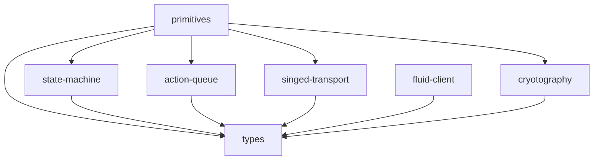
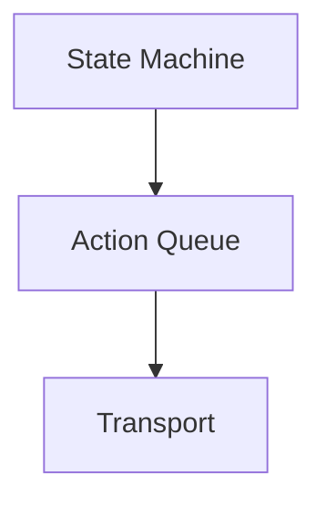

# Toolkit architecture

The toolkit consists of a set of packages, the idea being you can use whatever
you want out of it and swap out pieces for alternative implementations. For
example, if you don't want to use Fluid Framework for transport, you just need
to provide some other implementation of `ITransport` and everything else should
still work.

Here is the dependency diagram of the various packages:

The `primitives` package depends on most other packages since it aims to
implement some common operations you can plug into your own games "off the
shelf" (see the demos).

All other packages depend only on the `types` package, which declares common
types and interfaces.

Conceptually, the layering of the toolkit is:

At the bottom, we have the *transport*. The transport just sends messages
(actions) and emits events for incoming messages (actions). This maps closely
to and is informed by the way Fluid works. See [Total order broadcast & eventual consistency](https://fluidframework.com/docs/concepts/tob/).

The toolkit offers an abstraction over the transport, which encapsulates
consuming already received message, eventing on incoming new messages, and
posting messages from our clients in to a simple *async queue* which provides
only a `dequeue(): Promise<T>` and an `enqueue(value: T): Promise`. This
significantly simplifies using the transport.

The *state machine* helps modeling games. In general, a game is modeled as a
sequence of steps. Sometimes we need to run some code locally (and usually send
a message over the transport when we're done), sometimes we expect to receive
a message and run some code in reaction to that. The state machine helps us
declare such sequences and run them given a queue and some context.

See [modeling games](./modeling-games.md) for details on how to consume the
toolkit.
